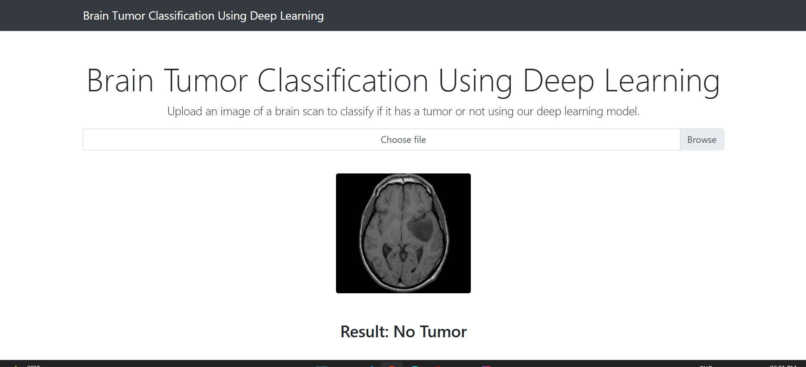
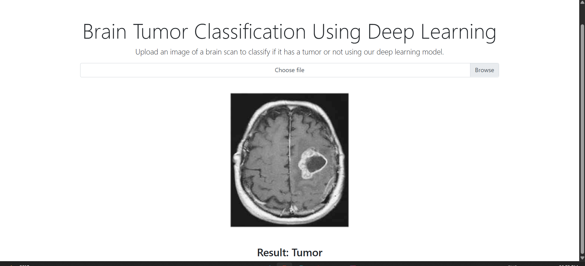

# 🧠 Brain Tumor Detection using Deep Learning

A deep learning-based web application for **brain tumor detection** from MRI scans.  
The project uses a **Convolutional Neural Network (CNN)** trained on MRI datasets and is deployed with a Flask web interface
for real-time predictions.  

## 🚀 Features

- 🧩 **Binary Classification** – Detects whether a brain tumor is present or not.  
- 🧠 **CNN Model** – Custom-built convolutional neural network trained on MRI datasets.  
- 📂 **Upload MRI Images** – Users can upload MRI scans via the Flask web app.  
- ⚡ **Real-time Predictions** – Instant results with probabilities.

Screenshots:

## 🛠️ Tech Stack

- **Language:** Python  
- **Deep Learning:** TensorFlow / Keras  
- **Computer Vision:** OpenCV, NumPy  
- **Web Framework:** Flask  
- **Deployment:** Localhost

## 📂 Project Structure

Brain_Tumor_Detection/
├── app.py # Flask app (frontend + backend integration)
├── mainTrain.py # CNN training script
├── mainTest.py # Model testing script
├── BrainTumor10Epochs.h5 # Trained CNN model
├── templates/ # HTML templates (index.html, result.html)
├── static/ # Static assets (CSS, images)
├── uploads/ # Folder to save uploaded images
└── brain_tumor_dataset/ # Dataset (train / val images)

📊 Model Workflow

Dataset Preprocessing – Images resized to 64×64 and normalized.
CNN Architecture – Convolution → Pooling → Flatten → Dense layers.
Training – Trained for 10 epochs with binary_crossentropy loss.
Prediction – Outputs probability → Tumor / No Tumor.
Web Deployment – Flask app for user interaction.
